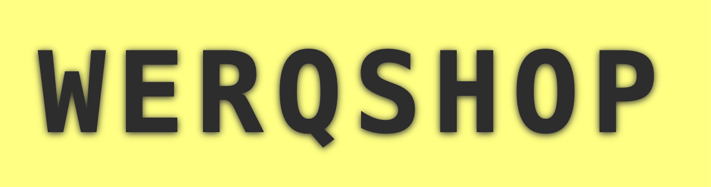

<h1><a href="https://werq.shop" class="logo" style="display: inline-block; margin: 0 auto; width: 300px;">
    
</a></h1>

This repository contains the source code and content for [WERQSHOP](https://werq.shop), the Workshop on Error Resilience in Quantum Computing.
The site is built with [Eleventy (11ty)](https://www.11ty.dev/) and is deployed via GitHub Pages.

## About

WERQSHOP is a community-focused technical workshop centered on quantum error mitigation, error correction, and noise-resilient quantum computing.
The event is organized by the Unitary Foundation and collaborators across academia and industry.

## Contributing

If you're a speaker and would like to:
- Update your **bio**  
- Add or update your **headshot**  
- Share a **PDF of your slides**

You can either:
- Open a pull request to this repo (edits go in the `talks/`), or
- Email your updates to `nate@unitary.foundation`

## Development

To build the site locally you'll need [Node.js](https://nodejs.org/) installed.

```bash
npm install
npm run serve
```
